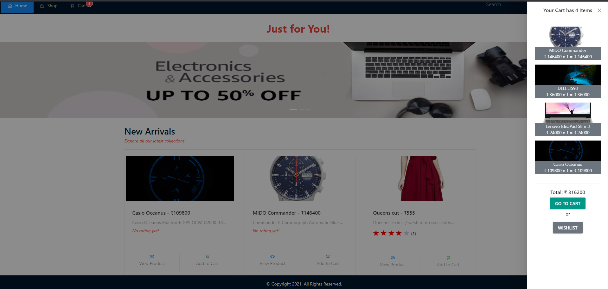
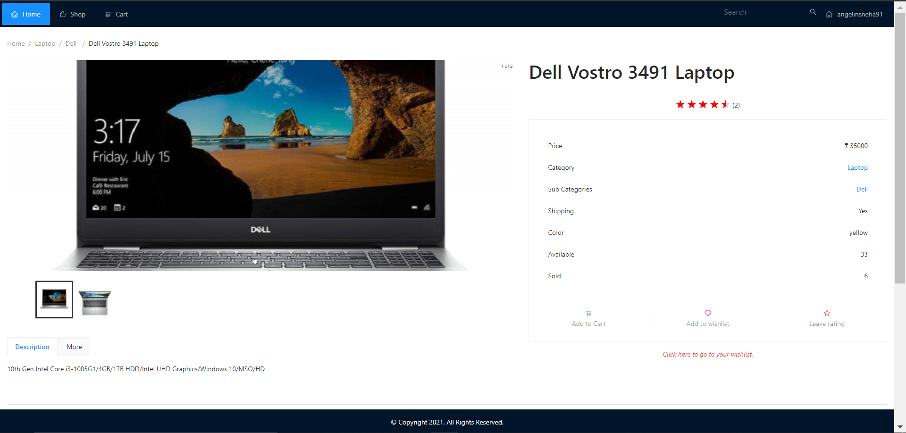

# Ecommerce Website

**_An Ecommerce Application to Shop Online!_**
 
_Admin can add products, categories, sub-categories or coupons._
 
_User can add products to his/her cart, apply coupons and order through card payment or Cash on delivery._

## Getting Started

### Node

1. `$ npm install` - To install all the node modules
2. `$ npm start` - To start the frontend Server
3. `$ nodemon server.js` - To start the backend Server

- After building the app, frontend and backend servers will be merged into a single server and be available at http://localhost:3000

 

 

 

 

- Created using ReactJS and NodeJS
