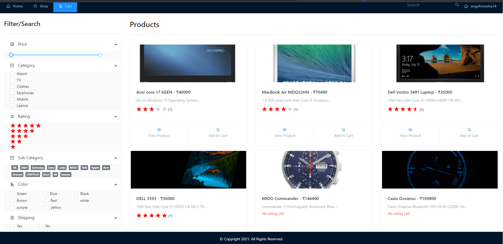

# Ecommerce Website

**_An Ecommerce Application to do Shopping Online!_**

## Getting Started

### Node

1. `$ npm install`
2. `$ npm start`
   After building the app, frontend and backend servers will be merged into a single server and be available at http://localhost:3000

 

 

 

- using ReactJS and NodeJS
